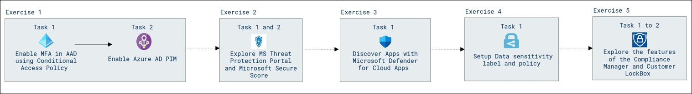

# Lab Scenario Preview: MS-900 Microsoft 365 Fundamentals: Describe Microsoft 365 security and compliance capabilities

## Lab 04: M365 Security and Compliance

### Lab overview

In this walkthrough, we will create M365 groups, forms, plans and assign tasks using Planner, also visualized sample data using Power BI and explored through EndPoint Manager.

### Objectives

After completing this lab, you will be able to:

- Enable MFA in AAD using Conditional Access Policy.
- Do Azure AD PIM
- Explore MS Threat Protection Portal.
- Use Microsoft Secure Score.
- Discover Apps with Microsoft Defender for Cloud Apps.
- Setup Data sensitivity label and policy.
- Explore Compliance Manager.
- Do Customer Lockbox.

### Architecture Diagram

Once you understand the lab's content, you can start the Hands-on Lab by clicking the **Launch** button located in the top right corner. This will lead you to the lab environment and guide. You can also preview the full lab guide [here](https://experience.cloudlabs.ai/#/labguidepreview/08e4ac19-130e-4bc9-8e2d-cdd15211dcfb) if you want to go through detailed guide prior to launching lab environment.