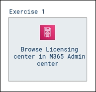

# Lab Scenario Preview: MS-900 Microsoft 365 Fundamentals: Describe Microsoft 365 pricing, licensing, and support

## Lab 05: Licensing

### Lab overview

In this walkthrough, we will browse through the licensing center and learn how to assign licenses to users from Microsoft 365 Admin center.

### Objectives

After completing this lab, you will be able to:

- Browse Licensing center in M365 Admin center

### Architecture Diagram

Once you understand the lab's content, you can start the Hands-on Lab by clicking the **Launch** button located in the top right corner. This will lead you to the lab environment and guide. You can also preview the full lab guide [here](https://experience.cloudlabs.ai/#/labguidepreview/24cd49f6-3658-44f8-bf71-6e9348db1515) if you want to go through detailed guide prior to launching lab environment.