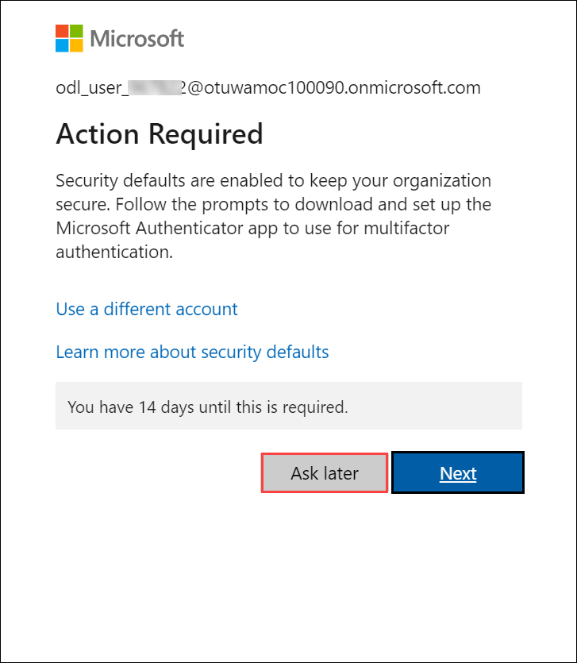
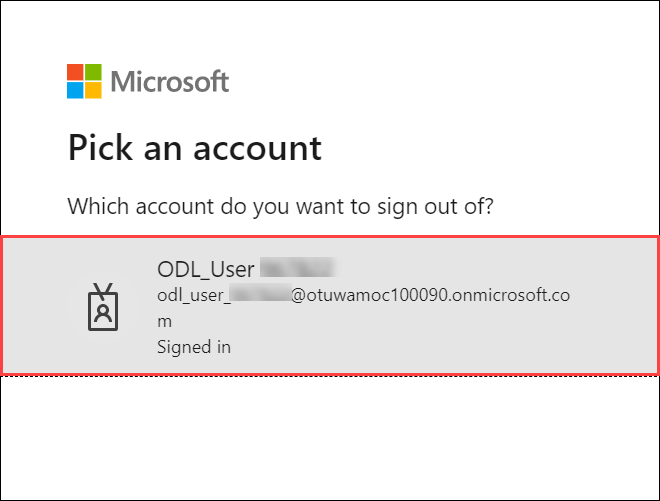
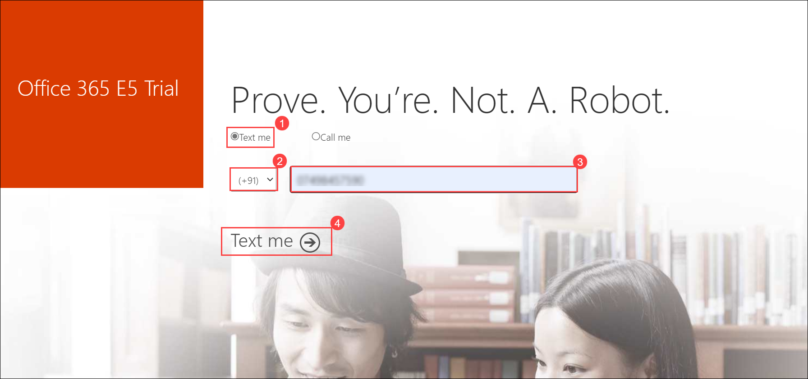

# Getting Started with Your MS-900: Microsoft 365 Fundamentals Workshop
 
Welcome to your MS-900: Microsoft 365 Fundamentals workshop! We've prepared a seamless environment for you to explore and learn about foundational-level knowledge of cloud-based solutions to facilitate productivity and collaboration on-site, at home, or a combination of both. Let's begin by making the most of this experience:
 
## Accessing Your Lab Environment
 
Once you're ready to dive in, your virtual machine and lab guide will be right at your fingertips within your web browser.
 

### Virtual Machine & Lab Guide
 
Your virtual machine is your workhorse throughout the workshop. The lab guide is your roadmap to success.
 
## Exploring Your Lab Resources
 
To get a better understanding of your lab resources and credentials, navigate to the **Environment Details** tab.
 

 
## Utilizing the Split Window Feature
 
For convenience, you can open the lab guide in a separate window by selecting the **Split Window** button from the Top right corner.
 

 
## Managing Your Virtual Machine
 
Feel free to start, stop, or restart your virtual machine as needed from the **Resources** tab. Your experience is in your hands!
 

 
## **Lab Duration Extension**

1. To extend the duration of the lab, kindly click the **Hourglass** icon in the top right corner of the lab environment. 

    

    >**Note:** You will get the **Hourglass** icon when 10 minutes are remaining in the lab.

2. Click **OK** to extend your lab duration.
 
   

3. If you have not extended the duration prior to when the lab is about to end, a pop-up will appear, giving you the option to extend. Click **OK** to proceed.

## Let's Get Started with Azure Portal
 
1. On your virtual machine, click on the Azure Portal icon as shown below:
 
.png)

 
2. You'll see the **Sign into Microsoft Azure** tab. Here, enter your credentials:
 
   - **Email/Username:** <inject key="AzureAdUserEmail"></inject>
 

 
3. Next, provide your password:
 
   - **Password:** <inject key="AzureAdUserPassword"></inject>
 

 
4. If prompted to stay signed in, you can click "No."
 
5. If a **Welcome to Microsoft Azure** pop-up window appears, simply click "Maybe Later" to skip the tour.
 
6. Click "Next" from the bottom right corner to embark on your Lab journey!
 
.png)
 
Now you're all set to explore the powerful world of technology. Feel free to reach out if you have any questions along the way. Enjoy your workshop!

## Sign up for Office 365 E5 free trial

1. Open a new browser window, click on the [Sign up for Office 365 E5 free trial](https://www.microsoft.com/en-us/microsoft-365/enterprise/office-365-e5) and click on **Free trial**.

1. Then on the next screen, in that enter following **Email** and then click on **Next**.

   * Email/Username: <inject key="AzureAdUserEmail"></inject>  

1. Click on **Sign in**. 

   
1. Now enter the following **Password** and click on **Sign in**.

   * Password: <inject key="AzureAdUserPassword"></inject>
   

1. If you see the pop-up **Action Required**, click **Ask Later**.

   
1. If for **Stay signed in** Pops up, Check **Do't show this again (1)** box and click on **yes (2)**.   

1. Click on the **Account**, you just signed in. 

1. Enter the **Phone Number**, then it will ask you to enter a **verification code** and **verify**.
   >**Note**: Make sure to provide a valid mobile number and choose the country code properly.

1. It show you the confirmation Message, Click on **Try Now**.

   >**Note**: On information required pop-up, select **Continue**, it will redirect you to the new page, then go back.
   

1. Will receive the order Receipt.

   
1. On the Next Page, Learn about how to create users, assign a license to the users, verify custom domains in the tenant, and see how to access other admin centers.
