# Module 1: Introduction to Microsoft 365 Admin Center

The Microsoft 365 admin center is where you manage your business in the cloud. You can complete tasks such as adding and removing users, changing licenses, and resetting passwords. Here are the features and settings you'll find in the left-hand navigation of the admin center.
  
   - **Home**: This is the landing page in the admin center. Here you will see where to manage users, billing, service health, and reports.
   
   - **Users**: From here you can create and manage users in your organization, like employees or students. You can also set their permission level or reset their passwords.
   
   - **Groups**: Create and manage groups in your organization, such as a Microsoft 365 group, distribution group, security group, or shared mailbox.
   
   - **Resources**: Create and manage resources, like a SharePoint site collection. 
   
   - **Billing**: View purchase or cancel subscriptions for your organization. View past billing statements or view the number of assigned licenses to individual users.
   
   - **Support**: You can view existing service requests or create new ones.
   
   - **Settings**: Manage global settings for apps like email, sites, and the Office suite. Change your password policy and expiration date. Add and update domain names like contoso.com. Change your organization profile and release preferences. And choose whether partners can access your admin center.
   
   - **Setup**: Manage existing domains, turn on and manage multi-factor authentication, manage admin access, migrate user mailboxes to Office 365, manage feature updates, and help users install their Office apps
   
   - **Reports**: See at a glance how your organization is using Microsoft 365 with detailed reports on email use, Office activations, and more.
   
   - **Health**: View the service health at a glance. You can also check out more details and the service health history.
   
   - **Admin centers**: Open separate admin centers for Exchange, Skype for Business, SharePoint, Yammer, and Azure AD. Each admin center includes all available settings for that service.

## Exercise 1: Admin Experience for User Management

In this exercise, you will learn how to create users, assign a license to the users, verify custom domains in the tenant, and see how to access other admin centers.
  
### Task 1: Admin Experience for User Management [Read-Only]

In this task, you will learn how to create and manage users from Microsoft Admin Center.

1. From the navigation menu, click on the **Users** icon and click on **Active users**. This will display the list of active users.

    

1. From the navigation menu, click on the **Teams & Groups** icon and click on **Active teams & groups**. This will display a list of all the groups that are created.

    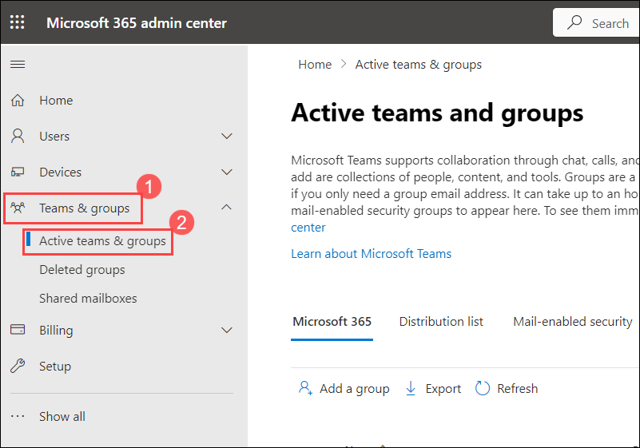

1. Now to create a new user, from the navigation menu click on **Users icon** and click on **Active users**, and then select **Add a user** icon.

    

1. In the **Set up the basics pane**, fill the following details, and then select **Next**.

   - **First name :** Odl

   - **Display Name:** Odl_User-<inject key="DeploymentID" enableCopy="false"/>

   - **Username:** Odl
     
   - **Automatically create a password**: unselected

   - **Password**: Enter a strong Password.

   - **Require this user to change their password when they first sign in** : unselected

     

1. In the  **Assign product licenses**  pane, choose your location from the **select location** dropdown. In the licenses section, choose **Assign user a product license** and select **office 365 E5** license. Click **Next**.

    

1. In the **Optional settings**  pane, leave everything as default and click on **Next**.

    

1. In the **Review and Finish** pane, review the new user&#39;s settings and click on **Finish adding**, then **Close**.

    
   
1. Verify that the user has been created successfully. In the Microsoft 365 admin center, in the left navigation pane, select **Users** and select **Active users**. The new user should be listed, along with their assigned license.

### Task 2: Access other admin centers

In this task, you will learn how to access other admin centers from Microsoft Admin Center.

1. Open [https://admin.microsoft.com](https://go.microsoft.com/fwlink/p/?linkid=2024339), to access other admin centers, from the navigation pane select **Show all**, under **Admin centers** choose **All Admin centers**. Opens a page with a full list of Office 365 admin centers, including admin centers for OneDrive, Yammer Enterprise, Dynamics 365, Power Apps, Skype for business, and other services.

    .png)
   
    .png)
   
1. In the admin center page select **Exchange**. This will redirect you to the Exchange admin center page. 

      
      
1. From here you can manage email settings for your organization. In the left-hand menu explore through the options available

     - **Recipients**  - View and manage your mailboxes (both user and shared mailboxes), groups, resource mailboxes, and contacts.

     - **Mail flow**   -  Manage remote domains and accepted domains, add connectors, trace messages and manage alert and alert policies.
     
     - **Migration**   -  Migrate mailboxes in batches.
     
     - **Reports**     -  View reports on mail flow and migration batches.
     
     - **Insights**    -  Use the recommendations to discover trends and/or insights, and take actions to fix issues related to mailbox and mail flow.
     
       

1. Switch back to the admin centers page, select **SharePoint**. This will redirect you to the SharePoint admin center page.

    

1. From here you can manage site collections, list and library permissions, file storage and sharing. Explore through the options available in **SharePoint** admin center.

    

1. In the same way you can access and explore through all other admin centers available.
   
## Exercise 2: Explore Microsoft 365 Apps

In the previous exercise, you learn how to create a user and how to assign an office 365 E3 license. In this exercise, you will explore Office 365 apps.

### Task 1: Explore Outlook

Microsoft Outlook is an application that is used mainly to send and receive emails. It can also be used to manage various types of personal data including calendar appointments and similar entries, tasks, contacts, and notes.

1. Switch back to the office365 user account portal and from App launcher under Apps, select **Outlook**.

1. When prompted enter the username and password of the ODL user.

1. From the top left corner click on **App launcher**.

    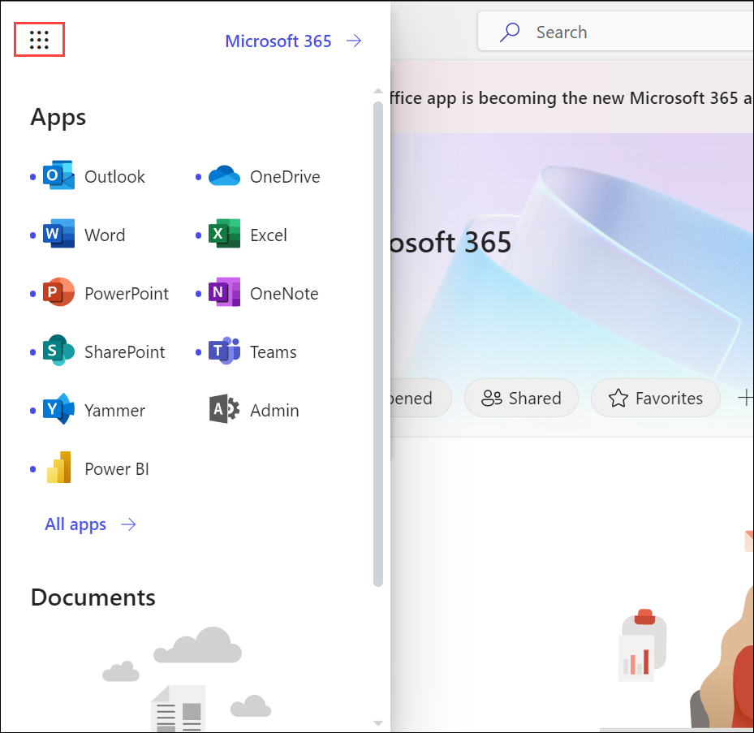

1. Under **Apps**, select **Outlook**.
   
    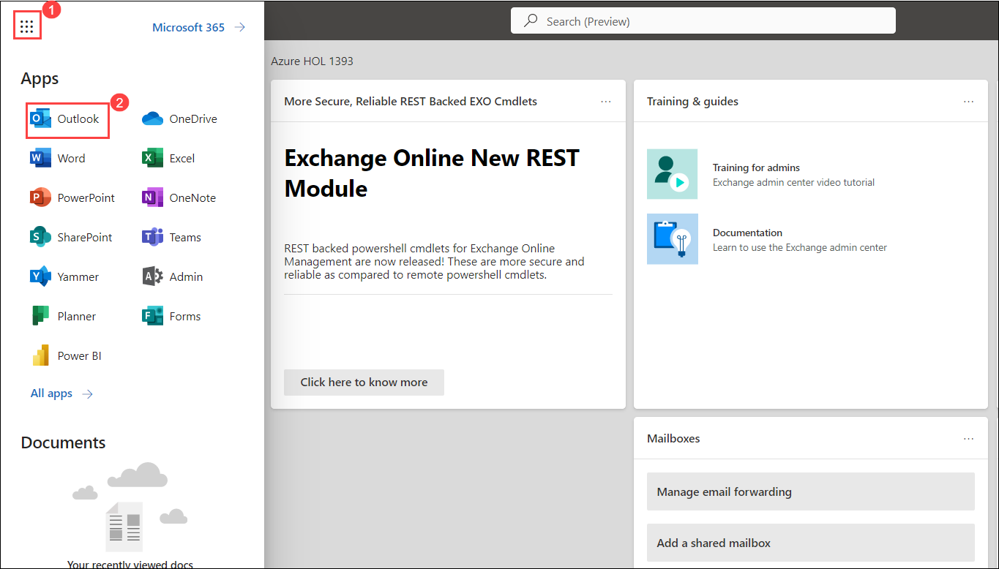
   
1. On the outlook page, choose **New Mail**  to send a new mail. Enter a name or email address in the To, Cc, or Bcc field. In Subject, type the subject of the email message.  Place the cursor in the body of the email message, and then start typing.  After typing your message, choose Send.

    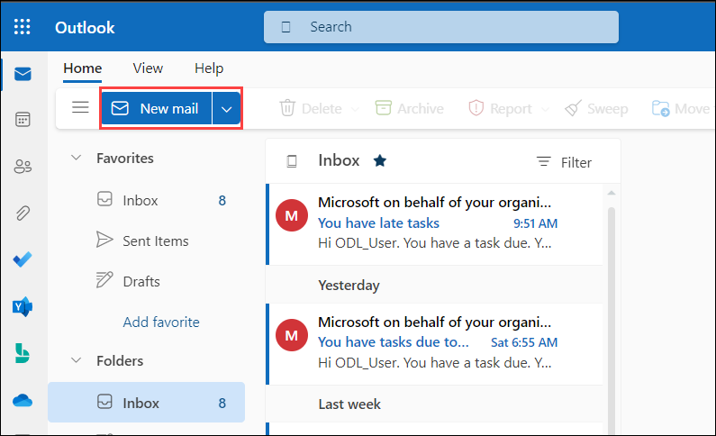
    
    .png)
    
   
1. From the left-hand menu select **Calendar**. From here you can create appointments, events, organize meetings and view group schedules.

    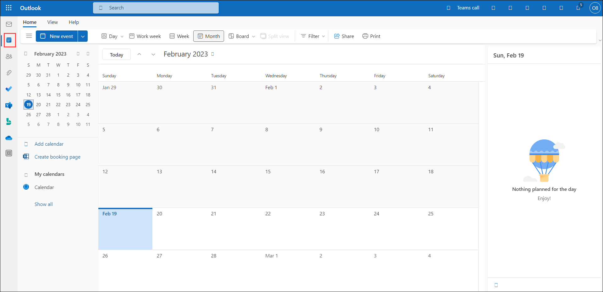
    
   
1. Now Select **People**, you can use the People page to view, create, edit, find, and delete contacts. You can use your contacts for your reference and can automatically add them as recipients when you compose an email message.

    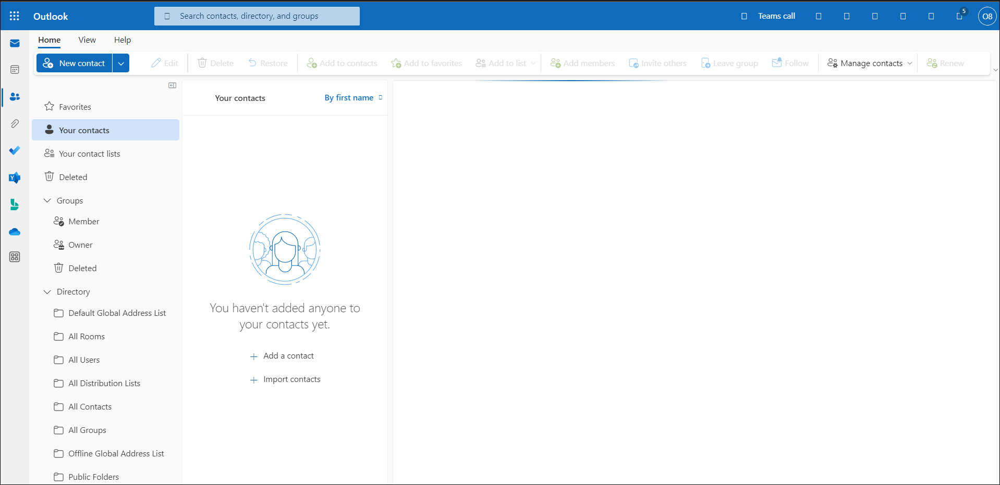
    
  1. From the left-hand menu you can explore all other options available. 
   
### Task 2: Explore OneDrive

OneDrive gives you one place to store, share, and sync your work or school files. As part of your organization's Microsoft 365 subscription, you can save your files in OneDrive and then work with them from almost any device, share files with others, give others permission to edit files and work on them at the same time.

1. Switch back to the office365 user account portal and from App launcher under Apps, select **OneDrive**, from here you can manage all your **files**, click on **Your OneDrive is ready**.
   
    
   
    

1. Now we will try to create a folder and upload files to it. On the OneDrive page click on **New** and select the **Folder** option, when prompted provide a name **Demo** for your folder and click on **Create**.
  
    
   
    .png)
   
    > **Note**: if you are not able to see your folder refresh the page.

1. Now select the newly created folder. From the top navigation bar select, **Upload** and select **Files**, when prompted choose the file(s) that you want to upload.

    
   
1. Select the new file that you have uploaded, click on the **Show actions** icon. This will display the list of actions that can be performed.

    
   
1. On the **OneDrive** page select the file or folder you want to share by selecting the circle in the upper corner of the item. Select Share at the top of the page.

    

1. Select **Anyone with the link can edit to customize the link** option. Set the options you want on your link, then select Apply when you are done.

    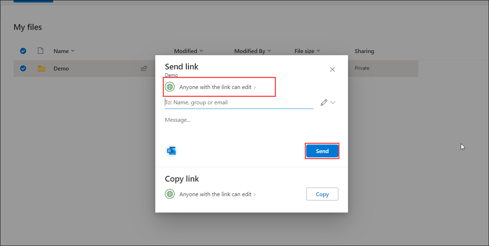

      - **Anyone**: Gives access to anyone who receives this link, whether they receive it directly from you or forwarded from someone else. This may include people outside of your organization.
      
      - **People in (Your Organization)**: Gives access to anyone in your organization who has the link access to the file.
      
      - **People with existing access**: Provides a link that can be used by people who already have access to the file or folder. It does not change the permissions on the item. Use this if you just want to send a link to somebody who already has access.
      
      - **Specific people**: Gives access only to the people you specify, although other people may already have access. 
      
      - **Allow editing**:  select if you want others to be able to edit the file. Uncheck it if you only want others to be able to view the file.
      
      - **Set expiration date**: The link will only work until the date you set. After that, the link will be invalid, and you will need to create a new link for users requiring access to your file or folder.

     - **Set password**: When a user clicks the link, they will be prompted to enter a password before they can access the file. You will need to provide this password separately to users.
     
    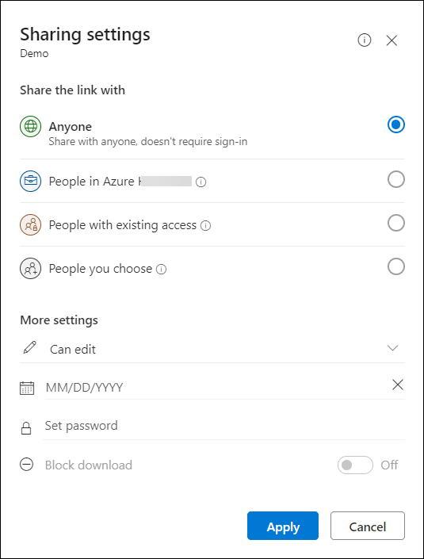
       
1. Once you're back at the main **Share** box enter a name or email of users with whom you intend to share the file, click on **Send**. You can also select **Copy Link** to copy the link to your clipboard and share it.
  
1. You can explore through other options available in the **OneDrive**. 

### Task 3: Explore yammer.

With yammer people can openly connect and engage across the organization, from here we can discuss ideas, share and collaborate with others.

1. Switch back to the office365 user account portal and from  **App launcher** under **Apps**, select **Yammer**.

    >**Note**: inside the Apps options, if Yammer is not listed, then select **Explore all your Apps**, on the apps page search and select **Yammer**.
 
    .png)

1. From the left-hand pane, select **communities**, click on **+ Create a community**, enter a name **Management** for your community. In **Members** search and select the users you want to add. Based on your requirement choose **Public** or **Private** access by click on **Edit**, after this click on **Create**.

      
   
    
   
    > **Note**: if you are not able to see your community refresh the page.

1. Now select the group that you newly created, click on **discussion**. Type the content that you like to post (you can include gifs, files or any website links based on the requirement). Click on **post**.
  
    
   
1. Switch back to the yammer account of the user whom you added to the group and verify if the user is added to the newly created group and if the posts are visible.
  
1. We can also send a private message to Yammer.
   
1. In the yammer dashboard click on the **Inbox** icon and select  **New Private Messages**. 
   
    .png)

1. In the **Add People** field, search or type the person's username. A drop-down menu of usernames that matches will appear.

1. Select the person's name that you want the message to be sent to, enter the message you want to send and then click on **Post**.

    

1. The recipient of the message will receive a notification about the received private message.

1. Explore through other options available in yammer.

### Task 4: Explore Microsoft Stream

Microsoft Stream is an Enterprise Video service where people in your organization can upload, view, and share videos securely. You can share recordings of classes, meetings, presentations, training sessions, or other videos that aid your team's collaboration.

1. In the office365 portal from the  **App launcher**, inside the Apps options, if stream is not listed, then select **Explore all your Apps**, on the apps page search and select **Stream**.

1. In the Stream page, select the **upload** button, and open **File Explorer > Windows (C:) > AllFiles**  and select the video.
   
    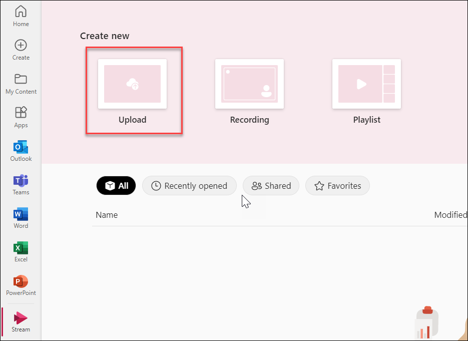
    
    > **Note**: if you are not able to see your video keep refreshing the page.

1. Select the video, by clicking on the video, it will redirect you to the new-browser

1. Now, click on **Share** button.

    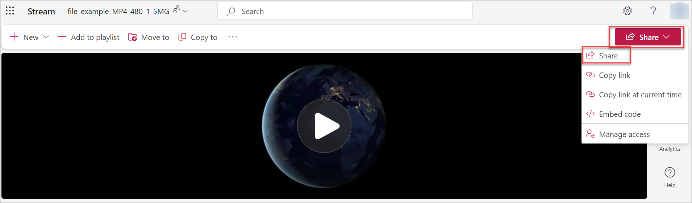
 
 1. Select **Anyone with the link can edit >**, now select **People you choose** and click on **Apply**, then enter the Username, click on **Send**.

    
   
1. Open a new browser window and log in to the outlook https://outlook.office.com/mail with the username in which you have sent the email, now check you have received an email after that click **open** it will open the video that you have shared it from the user you created.

    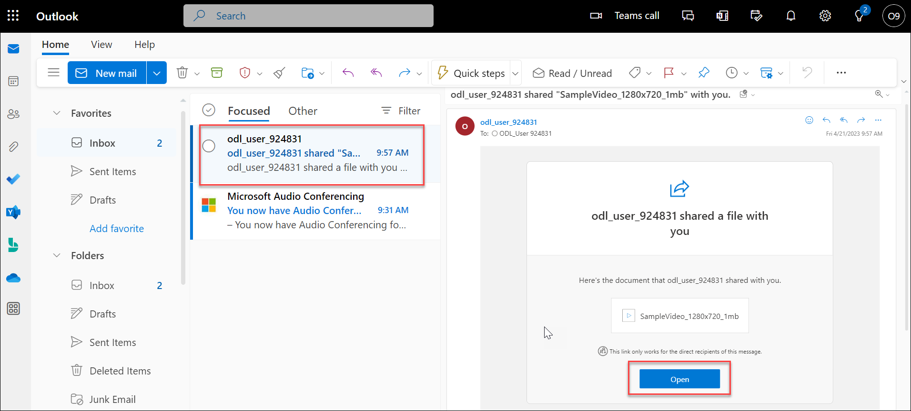

1. You can explore other options available in Microsoft Stream.

1. To learn more about Microsoft Stream refer to https://docs.microsoft.com/en-us/stream/overview.

### Task 5: Explore SharePoint

Microsoft SharePoint helps organizations share and manage content, knowledge, and applications to Empower teamwork, quickly find information and seamlessly collaborate across the organization.

1. In the office365 portal from the  **App launcher**, inside the Apps options, select **SharePoint**, if SharePoint is not listed, then select **Explore all your Apps**, on the apps page search and select **SharePoint**.

1. From the top of the SharePoint page, click **+ Create site (1)**  option. A site creation wizard will appear on the right-hand side of the screen. Based on your requirement you can select **Team site** or **Communication site**. For now, select **Team site (2)**.
   
    
   
    - Provide a name for your site
    
    - In the Privacy settings section, choose either **Public - anyone in the organization can access this site** or **Private - only members can access this site** to control who has access to your site.

    -  Select a language for your site and click on **Next**
    
     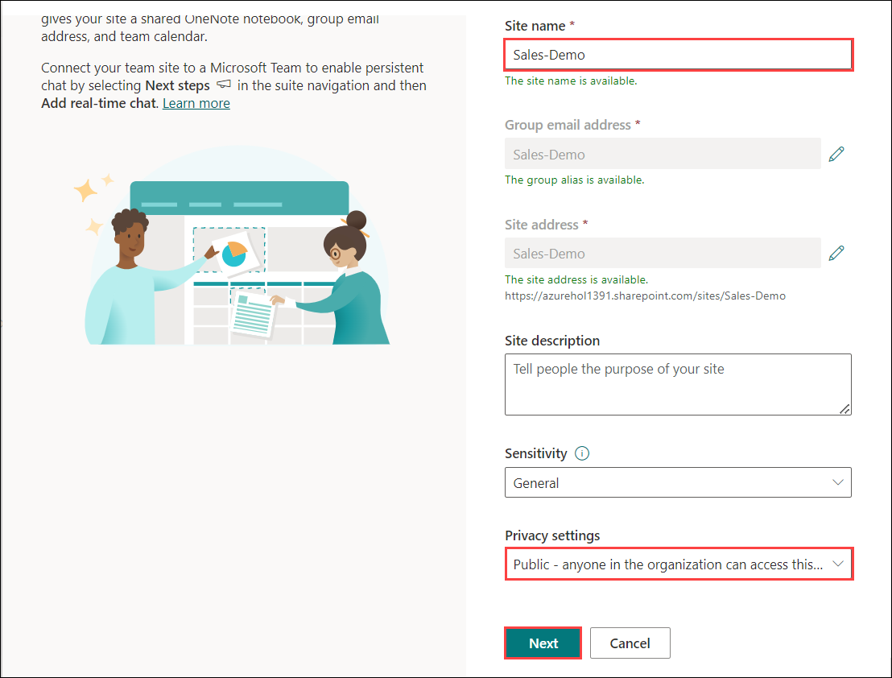
    
    -  In **Add group members** pane, under **Add additional owners box** add the names or email addresses of others whom you would want to allow to manage this site. In **Add members box**, add the name or email address of users you want to be a member of your site and then click **Finish**.  
    
1. Now let us add and publish a page on the newly created site.

1. On the home page of the site click on **New**, and then select **Page**.

    

1. Choose a page template to start with. For now, you can select **Blank** template and click on **Create page**.

    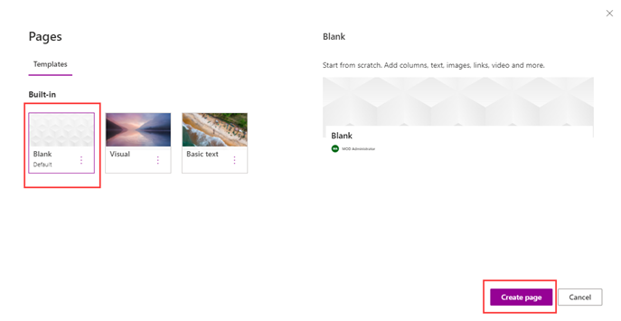

1. Add a page name in the title area. You can customize the title area with an image, a choice of four layouts, text above the title, the ability to change the displayed author, and you can show or hide the published date.

1. Select **Edit web part** icon from here you can select the layout of your choice, Set alignment, Add text above the title.
  
    

1. To add an image click on **Add image** button in the toolbar on the left. 

    

1. Choose a recent image or get an image from a web search, your site, your computer, or a link. If your organization has specified a set of approved images, you'll be able to choose from that set under Your organization. 

    

1. In **text box** you can add the content. Click on **+** to add content like text, documents, video and more. 

    

1. When done, click **Publish**. This will publish a page on your site.

1. To learn more about SharePoint refer to https://docs.microsoft.com/en-us/sharepoint/introduction.

### Task 6: Explore Lists

List helps to track information and organize your work. With a list, one can track issues, assets, routines, contacts, inventory and more using customizable views and smart rules and alerts to keep everyone in sync.

1. In the office365 portal from the  **App launcher**, inside the Apps options, select **Explore all your Apps**, on the apps page search and select **Lists**. 

1. On the home page of **Lists** click on **+ New list**. 

    

1. From the Create a list page, select **+ Blank list**. 
 
    - Provide a name for your list and if needed provide a description.
    
    - Choose a colour and icon for your list.
    
    - In **Save to** select a location where you want your list to be saved. Click on **Create**
   
     
    
 1. When your list opens, to add an item to your list, select **+ New**. 
   
     
 
 1. Under **Title** provide a name for your new item, if needed you can also add attachments. Once done click on **Save**.
 
 1. To add a column, select **+ Add column**. In the dropdown, select the type of column you want.
 
    .png)
 
 1. In the Create a column panel, in the **Name** field, enter a title or column heading. Enter any other required information. The number of fields will vary with the column type you choose. The above example is for a **Multiple lines of text** field.
 
    

1. Select **Save**. In this way, you can add multiple items and columns to your list.

1. To rename a column, select the column which you want to rename select **Column settings** and select **Rename**. When prompted provide column name and select **Save**.

    

1. Now select the item which you have added click on **Show actions** and select **Edit**  from here you can add value against the newly created column.

    
    
    

1. To share your list select **Share** near the top of the page.

    
    
1. Enter a name or email address. To change the access permissions, you are granting to people, select **Can edit** and then select an option based on requirement. 

    

1. In the Alert Title section, change the title for the alert if you want. Within the **Send Alerts To section**, enter the usernames or email addresses of people you want alerts to be sent to.

    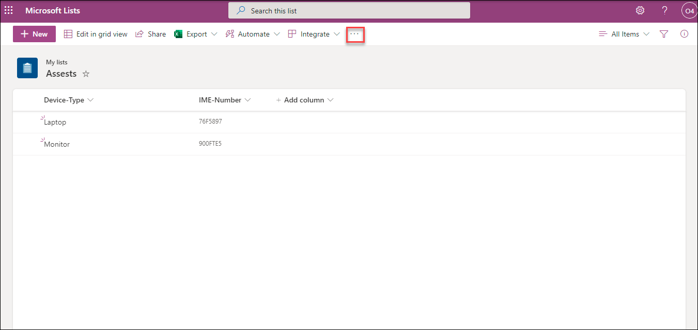
   
    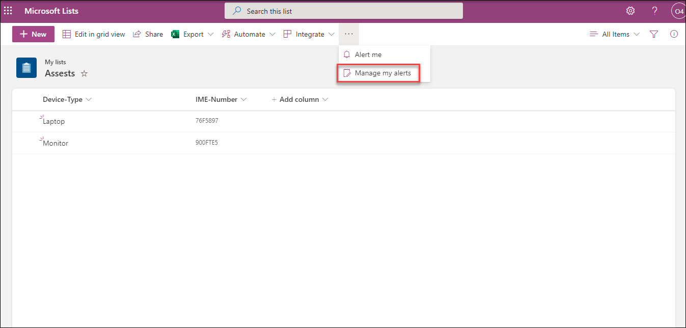
   
    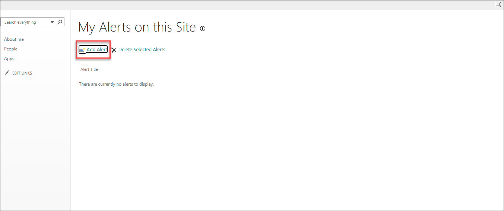
   
    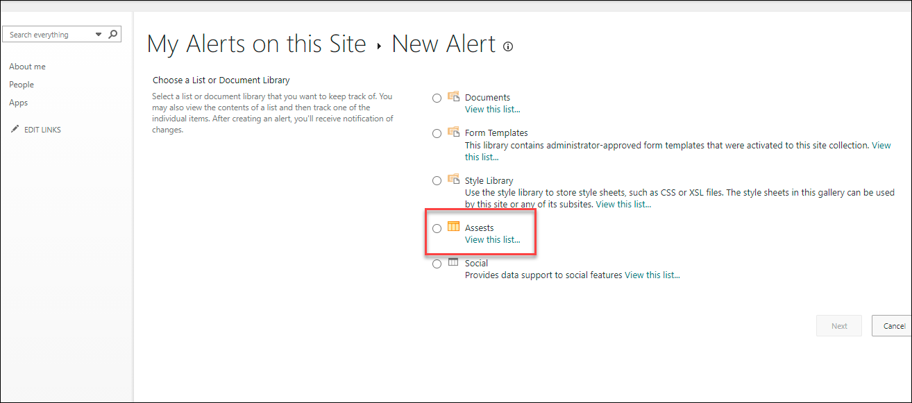

1. Select a delivery method, choose the types of changes that you want to be notified about, how frequently you want to receive the alert. Once done select **Ok**.

    

1. Depending on how your site and servers are set up, whenever changes are made the person you created an alert for will be notified.

1. You can explore other options available in Microsoft List.

## Conclusion

In this module, you have learned how to create users and assign licenses to the users from the Microsoft 365 admin center. You have also learned how to add domains and the process to access other admin centers and explored through various office365 apps.

