# Module 04: M365 Security and Compliance 

## Lab Scenario
This module helps you to understand various features that contribute to overall organization security.

## Lab objectives

In this lab, you will perform:

+ Exercise 1: Microsoft Entra ID Security 
+ Exercise 2: Threat Protection
+ Exercise 3: Microsoft Defender for Cloud Apps
+ Exercise 4 : Information Protection
+ Exercise 5: Compliance Manager

## Estimated Timing: 90 minutes

## Architecture diagram

### Exercise 1: Microsoft Entra ID Security 

In this exercise, you will understand how to enable MFA in Microsoft Entra ID. Then Configure and manage access to important resources using Microsoft Entra ID PIM.
  
#### Task 1: Enable MFA in Microsoft Entra ID using Conditional Access Policy 

In this task, you will enable MFA in Azure Active Directory using Conditional Access Policy and verify the policy.

1. Open a new browser window and log in to the admin center at [https://admin.microsoft.com](https://go.microsoft.com/fwlink/p/?linkid=2024339).

1. When prompted, use the credentials provided in the **Environment Details** page to log in to the admin center.

1. From the navigation menu scroll down to  **Admin centers** and select **All admin centers**, select **Microsoft Entra**.

1. On the left side of the page scroll down to the **Protection**. Select the dropdown next to **Protection (1)** then select **Conditional access (2)**.

   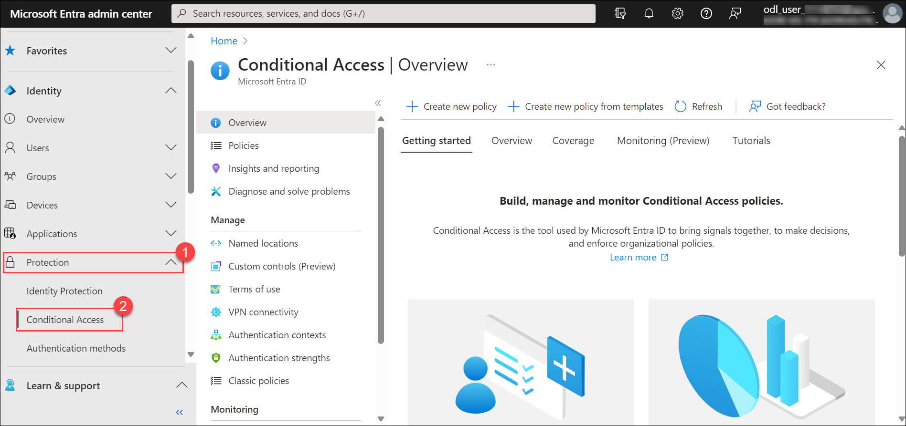

1. At the top of pane, click **+ Create New Policy**. 

1. Provide a name for your policy as **MFA policy**. Under Assignments, select **0 Users and groups**. In the Include tab, **select users, and groups** and select the **Users and groups** from the list and select the user's you intend to enable MFA and click on **Select**.

   

1. Under **Target resources**, select **No target resources selected**. In the Include tab, select **Select Apps**, under **Select**, select the apps for which you intend to apply policy.

1. Now under **Conditions** tab, select **0 conditions selected**, select **Client apps** and in **Client apps** page under **Configure** select **Yes** and then select **Done**. You can also make use of other conditions like risk, device platform, or location based on your requirement.
   
1. Now under **Access controls** select **Grant**, and then select **Grant access**, check the **Require multi-factor authentication** checkbox, and click on **select**.
   
1. Confirm your settings and set Enable policy to **On**. Click on **Create** to create and enable your policy.

    >**Note :** You may see the error that Security defaults must be disabled to enable Conditional Access policy.

1. Open the Azure Portal from the desktop, sign-in if required. In the **Search resources, services, and docs**, search and select the **Microsoft Entra ID**, sign in if required and then Select **Properties** then Click on **Manage security defaults** and disabled it by selecting **My Organization is Using Conditional Access** and click on **save**.
   
   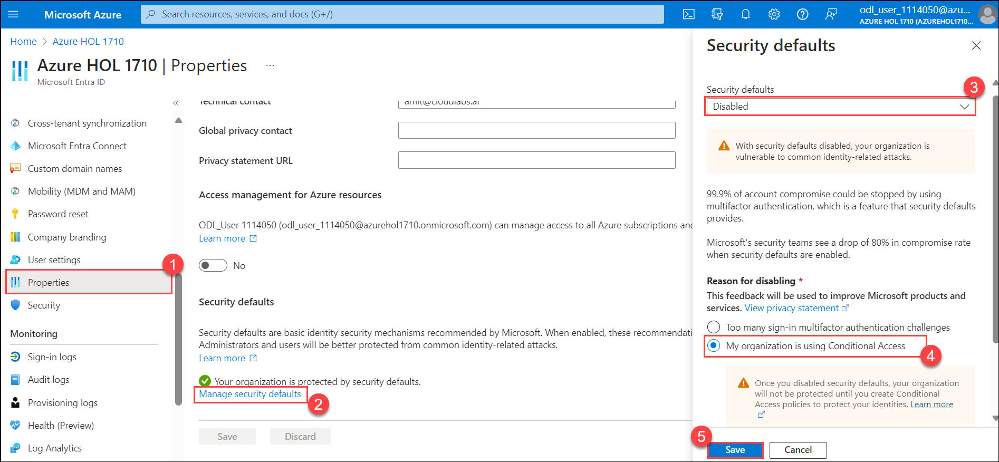

   >**Note:** Under **Disable security defaults** pop-up select **Disable**.
       
1. Now to test the policy open the admin center account in incognito/private window and login to the user for whom you enabled MFA. From **App launcher** under Apps, select the app for which you enabled MFA.

   

1. You're required to register for and use Azure Multi-Factor Authentication. For more information required page click **Next**.

1. Follow the prompts to complete the process and verify you successfully sign into the portal.

   
   
   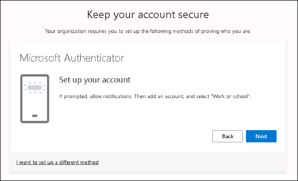   
   
   
 
   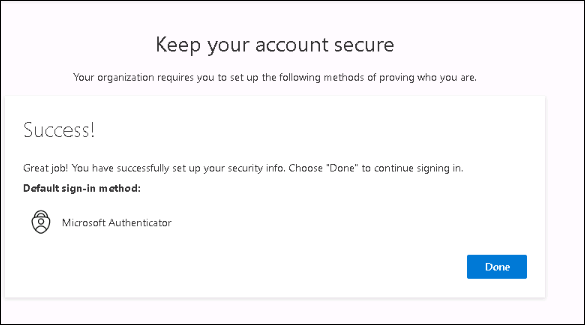
   
1. To learn more about conditional access and policies refer to https://docs.microsoft.com/en-us/azure/active-directory/conditional-access/overview.

#### Task 2: Privileged Identity Management                                                                                                                                             
Privileged Identity Management (PIM) is a service in Microsoft Entra ID that enables you to manage, control, and monitor access to important resources in your organization. These resources include resources in Microsoft Entra ID, Azure, and other Microsoft Online Services such as Microsoft 365 or Microsoft Intune.

1. From the navigation menu scroll down to  **Admin centers** and select **All admin centers**, and on the **All admin centers** page, select **Microsoft Entra**.
   
1. On the Microsoft Entra admin center page, select **Identity governance** and then select **Privileged Identity Management**.

   

1. Under **Manage** select **Azure AD roles**.

1. Now select **Settings**, from here you can configure role settings. Explore through the roles and select the role which you want to configure.

   

1. Select **Edit** to open the Role settings page. On the Role setting page for each role, there are several settings you can configure.

   

1. Use the **Activation maximum duration** slider to set the maximum time, in hours, that a role stays active before it expires. This value can be from 1 to 24 hours.

   

1. To require multi-factor authentication before activation, check the Require Multi-Factor Authentication on the activation box in the Assignment tab of the Edit role setting.

1. **Requires approval to activate** Specifies whether a member of the Privileged Role Administrators or Security Administrators group is required to approve the activation.

1. Now select **Assignment**, from here you can choose one of the eligible assignment duration options.

1. Select **Notification**, from here we can configure to receive notification when a member is assigned as eligible to the role or when a role is activated.

1. Now to assign a role, within the **Azure AD Privileged Identity Management** page under manage, click on **Roles**. This displays a list of roles for Azure AD permissions.

1. Select **+ Add assignments** to open the Add assignments page.

1. From the **Select role** drop-down select a role you want to assign, and under **Select members** select a member to whom you want to assign the role, and then select **Next >**.

1. In the **Assignment type** list on the **Membership settings** pane, select **Eligible** or **Active**.

     -  **Eligible assignments** require a member of the role to perform an action to use the role. Actions might include performing a multi-factor authentication (MFA) check, providing a business justification, or requesting approval from designated approvers.

     -  **Active assignments** do not require the member to perform any action to use the role. Members assigned as active have the privileges assigned to the role at all times.
     
1. To specify a specific assignment duration, add a start and end date and time boxes. When finished, select **Assign** to create the new role assignment.

   >**Note:** Make sure Permanently eligible box is unchecked.

1. After the role is assigned, an assignment status notification is displayed.

1. Now select **Assignments** from here you can check **Eligible**, **Active** and **Expired** assignments. You can also add new assignments from here.

   
   
1. You can learn more about Privileged identity management by referring to https://docs.microsoft.com/en-us/azure/active-directory/privileged-identity-management/pim-configure.

> **Congratulations** on completing the task! Now, it's time to validate it. Here are the steps:
- Click the Lab Validation tab located at the upper right corner of the lab guide section and navigate to the Lab Validation Page.
- Hit the Validate button for the corresponding task. If you receive a success message, you can proceed to the next task. 
- If not, carefully read the error message and retry the step, following the instructions in the lab guide.
- If you need any assistance, please contact us at labs-support@spektrasystems.com. We are available 24/7 to help you out.

### Exercise 2: Threat Protection 

In this exercise, you will explore through Microsoft threat protection portal and Microsoft Secure Score.

#### Task 1: Explore MS Threat Protection Portal [Read-Only]

Microsoft Threat Protection is a unified pre- and post-breach enterprise defense suite that natively coordinates detection, prevention, investigation, and response across endpoints, identities, email, and applications to provide integrated protection against sophisticated attacks.

In this task, you will explore Microsoft Threat Protection Portal.

1. The Microsoft 365 security center provides security administrators and other risk management professionals with a centralized hub and specialized workspace that enables them to manage and take full advantage of Microsoft 365 intelligent security solutions for identity and access management, threat protection, information protection, and security management.

1. From the **App launcher** click on All apps and in the search bar search for **Security**, from **Open context menu** click on Open in new tab. This will redirect you to the **Microsoft 365 Defender** web page.

   >**Note**: If the Microsoft 365 defender page is not opening. Navigate to the link given [Microsoft 365 Defender](https://security.microsoft.com/homepage)

1. The home page provides an at-a-glance view of the overall security health of your organization.

   

1. Click on **incidents & alerts**, select **Alerts** as we can View various Alerts.

   >**Note:** New users won’t have enough data to view various **Alerts** breakdowns within the application

   

1. Select **Reports** from the menu and then select **Security Report** from here you can view security trends and track the protection status of your identities, data, devices, apps, and infrastructure.

   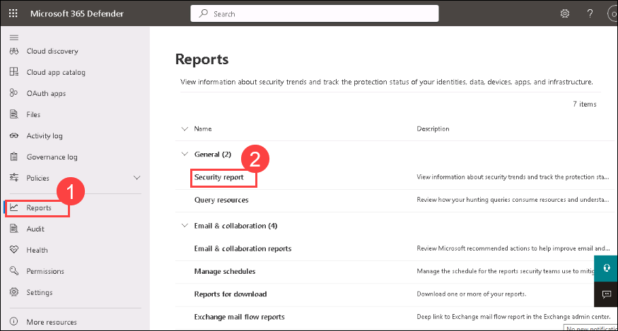

1. Select **Secure Score** this page provides an all-up summary of the different security features and capabilities you have enabled and includes recommendations for areas to improve.

   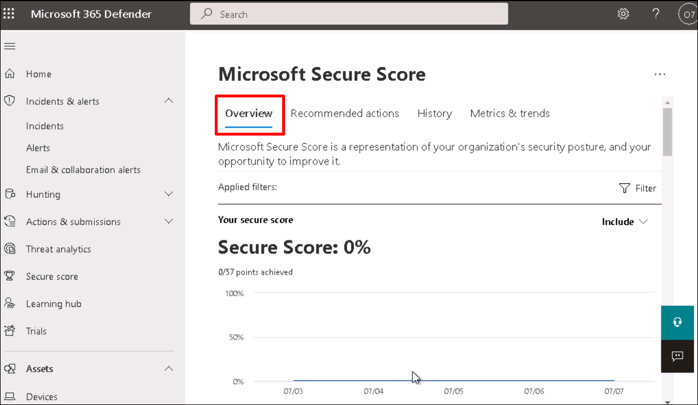
   
1. To learn more about Threat Protection refer to https://docs.microsoft.com/en-us/microsoft-365/security/mtp.

#### Task 2: Microsoft Secure Score 

Microsoft Secure Score is a measurement of an organization's security posture, with a higher number indicating more improvement actions taken. Following the Secure Score recommendations can protect your organization from threats. From a centralized dashboard in the Microsoft 365 security center, organizations can monitor and work on the security of their Microsoft 365 identities, data, apps, devices, and infrastructure.

In this task, you will learn about Microsoft Secure Score.

1. On **Microsoft 365 admin centre** page, under **Admin centres**, select **Security**. This will redirect you to the **Microsoft 365 Defender** web page.

   >**Note**: If the Microsoft 365 defender page is not opening. Navigate to the link given [Microsoft 365 Defender](https://security.microsoft.com/homepage)

1. Select **Secure Score** from the left-hand menu. On the **Overview** page your score will be shown as a percentage, along with the number of points you have achieved out of total possible points.

1. Additionally, if you select the Include button next to your score, you can choose different views of your score.

    - **Planned score**: Shows projected score when planned actions are completed.
    
    - **Current license score**: Shows score that can be achieved with your current Microsoft license.
    
    - **Achievable score**: Shows score that can be achieved with your Microsoft licenses and current risk acceptance.
    
   
    
1. Now select **Recommended actions** tab, this lists the security recommendations that address possible attack surfaces. It also includes their status (to address, planned, risk accepted, resolved through the third party, resolved through alternate mitigation, and completed).

   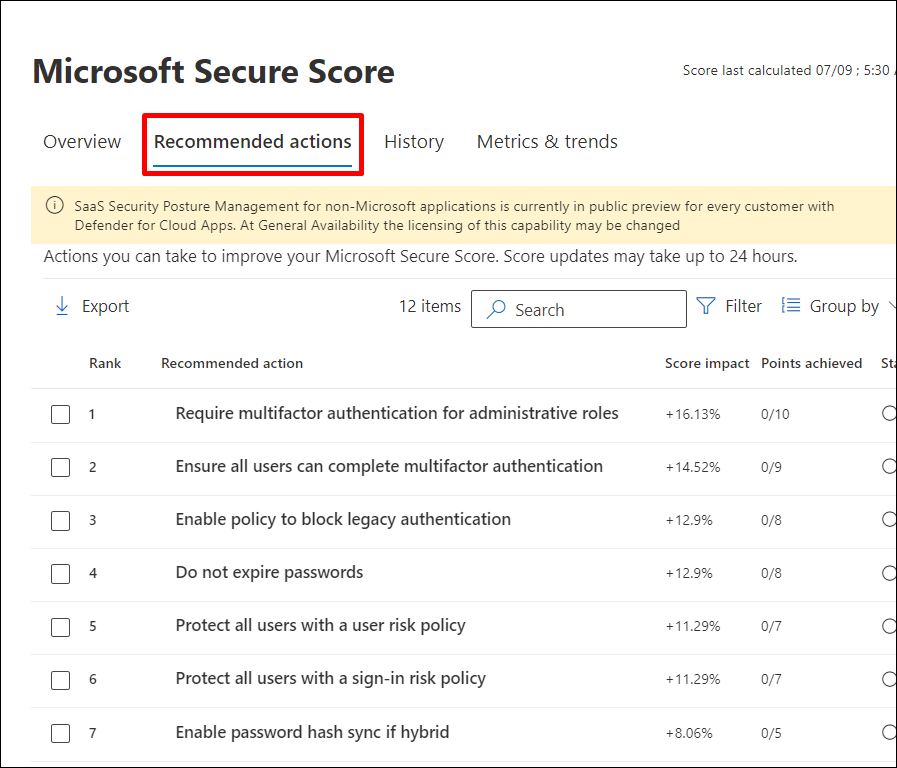

1. When you select a specific improvement action, a full-page flyout appears.

   - **Manage**: Select Manage to go to the configuration screen and make the change. You will then gain the points that the action is worth, visible in the flyout.
   
   - **Share**: Select Share to copy the direct link to the improvement action. You can also choose the platform to share the link, such as email, Microsoft Teams, Microsoft Planner, or ServiceNow. 
   
   
 
1. To learn more about secure score refer to https://docs.microsoft.com/en-us/microsoft-365/security/mtp/microsoft-secure-score?view=o365-worldwide.
       
### Exercise 3: Microsoft Defender for Cloud Apps

In this exercise, you will use the Microsoft Defender for Cloud Apps portal to identify the sensitivity and criticality of data and apps owned by an organization and address them.

#### Task 1: Discover Apps with Microsoft Defender for Cloud Apps  

Microsoft Cloud App Security is a multi-mode Cloud Access Security Broker (CASB). It provides rich visibility, control over data travel, and sophisticated analytics to identify and combat cyber threats across all your cloud services.

1. On **Microsoft 365 admin centre** page, under **Admin centres**, select **Security**. This will redirect you to the **Microsoft 365 Defender** web page.

1. Open a new tab and navigate to the https://portal.cloudappsecurity.com/.
  
1. From the left-hand menu select **Dashboard**. In the dashboard you can see details about:

   - **Alerts**: Shows the number of open alerts, a graph of the alert status distribution, and recent alerts

   - **Discovered apps**: Shows the number of discovered apps, a graph of the app risk distribution, and the top app categories by traffic.

   - **Top users to investigate**: Shows the number of users to investigate and the users with the highest investigation priority.

   - **Conditional Access App Control**: Shows the number of apps protected by Conditional Access App Control as well as the number of protected sessions and actions over the last 30 days.
   
   - **App connectors**: Shows the number of API connected app instances and their status.

   - **Files infected with malware**: Shows the number of files infected with malware.

   - **Privileged Office 365 OAuth apps**: Shows the number of rarely used OAuth apps granted highly privileged permissions.

   - **Azure security configuration**: Shows the number and severity of Azure security configuration recommendations.
   
   

1. Now from the left navigation menu select **Discover**. Cloud Discovery uses your traffic logs to dynamically discover and analyze the cloud apps that your organization is using.

1. Under **Discover** select **Create snapshot report**. 
  
    >**Note**: if could not found under **Discover**, then select **Settings (1)** in the top right corner and click **settings (2)**, Under **Cloud Discovery (3)**, select **Snapshot reports (4)**, and click **+ Create snapshot report(5)**.
   
   

1. Collect log files from your firewall and proxy, through which users in your organization access the Internet. Make sure to gather logs during times of peak traffic that are representative of all user activity in your organization.

1. If you do not have a log file follow the below steps to download a sample log file.

1. Under overview tab, click **Next >**.
  
1. Under **Report Details** tab, Enter a **Report name** and a **Description**. Select the **source** from which you want to upload the log files. Click **View log format** then Download sample log and click on **Next >**.
   
   

1. Under **Upload Traffic Logs** tab, browse and upload the log file which you downloaded. Select **Upload logs >**.

   

1. After the upload completes, the status message will appear **Your Cloud Discovery snapshot report is being generated**, select **Close**.

1. After you upload your log files, it will take some 20-30 mins for them to be parsed and analyzed. Wait till the status of your log files turns **Ready**.

   

1. Now from the left-hand menu under **Discover** select **Cloud Discovery Dashboard**. It provides an at-a-glance overview of what kinds of apps are being used, your open alerts, and the risk levels of apps in your organization. It also shows you who your top app users are and provides an App Headquarter location map.

   
   
   

1. Click on **Discovered apps** tab, from here you can review which apps are risky and which are commonly used by using filters like:

    - **App tag**: Tags enable you to customize the Cloud App Catalog. You can select from either Sanctioned, Unsanctioned, or create custom tags for apps. These tags can then be used as filters.
    
    - **Risk score**: Lets you filter apps by risk score that you can focus on. For example, reviewing only risky apps.
    
    - **Compliance risk factor**: Lets you search for specific standards, certification, and compliance that the app may comply with.
    
    - **Security risk factor**: Enables you to filter based on specific security measures (such as Encryption at rest, multi-factor authentication, etc.).
    
    - **Apps and domains**: Enables you to search for specific apps or apps used in specific domains.
    
    - **Categories**: The categories filter, located on the left of the page, enables you to search for types of apps according to app categories.
    
    - **Usage**: Lets you filter based on the usage statistics of this app. Usage such as apps with less than or more than a specified number of data uploads, apps with more than or less than a specified number of Users.
    
    - **Legal risk factor**: Lets you filter based on all the regulations and policies that are in place to ensure data protection and privacy of the app's users.
    
   
    
1. Explore through other **Discovered resources**, **IP address** and **Users** tab.

1. From the left-hand pane select **Alerts**. Alerts are the entry points to understanding your cloud environment more deeply.

1. On the Alerts page, select Open for the **Filters**. This section of the dashboard provides full visibility into any suspicious activity or violation of your established policies. It can help you safeguard the security posture you defined for your cloud environment.

   

1. For each alert, you need to investigate and determine the nature of the violation and the required response. You can filter the alerts by **Alert type**, by **Severity**, by **App** or by **User Name** to process the most important ones first.
    
   
    
1. You can also customize alerts and actions by creating policies. In the alerts page click on **Create policy**. Select **App discovery policy**. Based on your requirement you can choose other **policies**.
 
   
 
1. Give your policy a name and description. If you want, you can base it on a template. Set the severity of the policy.
 
   
 
1. To set which discovered apps trigger this policy, click **+** add filters. From the dropdown select the filter based on your requirement.
 
   
 
1. Enable **Trigger a policy match if all the following occur on the same day**. Select criteria from the drop-down based on your requirements.
 
   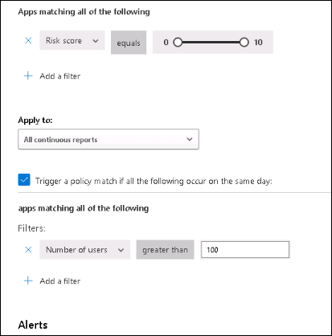
 
1. Set a **Daily alert limit** under Alerts. Select whether the alert is sent as an email, a text message, or both. 
 
   
 
1. Select **Governance actions** to apply when an app matches this policy. It can tag policies as **Sanctioned**, **Unsanctioned**, or a custom tag. Click **Create**. 
 
   
 
1. Alert will be triggered whenever an app with your specified conditions meet, notification will be sent to the email or number specified.
 
1. To learn more about Cloud App Security refer to https://docs.microsoft.com/en-us/cloud-app-security.
 
### Exercise 4 : Information Protection 

In this exercise, you will learn how to classify and protect your organization's data using a sensitivity label.

#### Task 1: Setup Data sensitivity label and policy 

Sensitivity labels from the Microsoft Information Protection framework let you classify and protect your organization's data while making sure that user productivity and their ability to collaborate isn't hindered.

1. On **Microsoft 365 admin centre** page, under **Admin centres**, and select **Compliance**, the Microsoft Purview page will appear.

   

1. Now under **Solutions**, select **Information protection**.

1. On the **Labels** page, select **Turn on** under **Extend labeling to assets in Azure Purview** and select **yes** for **Turn on labelling for Microsoft purview Data Map**.

   

1. Now on the **Labels** page, select **+ Create a label** to start the new sensitivity, label wizard.

   

1. Enter a **Label name** as **Demo sensitivity label**  and provide the same name to **Display name** and **Description for users**.Select **Next**.
   
1. Leave all defaults in **Scope** page and click on **Next**. 
  
1. In the **Choose protection settings for labelled items** page, select **Apply or remove encryption** and **Apply content marking**. Click **Next**. 

   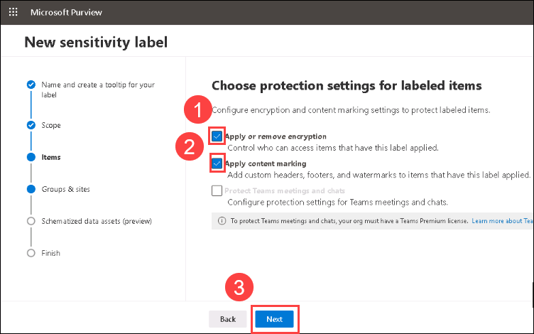

1. In the **Encryption** page, choose when you want to assign permissions, whether you want your users access to the content to expire, and whether you want to allow offline access. 
      
      - **Assign permissions now or let users decide?** : select **Assign permissions now**.
      
      - **User access to content expires** : select **On a specific date**. You can also select other options based on requirement.
      
      - **Access expires** : Select a date. After this time, users won't be able to open the labelled item.
      
      - **Allow offline access** :  Never, always, or for a specific number of days after the label is applied. If you restrict offline access to never or a number of days, when that threshold is reached, users must be re-authenticated and their access is logged. 
      
1. Under **Assign permissions to specific users or groups** click on **Assign permissions**. From here you can grant permissions to specific people so that only they can interact with the labelled content.
 
1. In the **Assign permissions** pane, add users or groups that will be assigned permissions to the labelled content. For now, select **+ Add users or groups** and select the user or group for whom you want to assign the label. Select **Add**.

   
   
   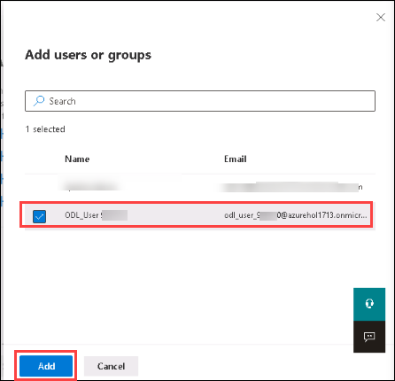  
 
1. Now in **Assign permissions** pane, click on **Choose permissions**. 

   

1. When you choose which permissions to allow for those users or groups, you can select either a predefined permissions level with a present group of rights, such as Co-Author, CO-Owner, Reviewer or Viewer and Custom permissions, where you choose one or more usage rights, select **Save**.

   
   
1. On the **Assign Permissions** pane, select **Save**. Click on **Next**.

   

1. On the **Content Marking** page, you can configure the Header, Footer, and the Water Marking for this label by adding customize text and click on **Next**.

   
   
   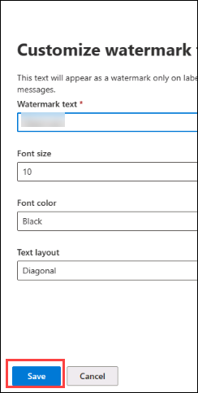

   
   
1. In **Auto-labeling for Files and Emails**, turn on **Auto-labeling for files and emails**. Add a condition, under **Detect content that matches these conditions**, select **+ Add a condition**, and select **Content contains**. Under Content contains page, select **Add** drop-down, select **Sensitive info types**.

   

1. Under **Sensitive info types** , select an option from your choice and select **Add**, after adding your sensitive info types, select **Next**.
   
   

1. **Groups & Sites** is used to configure privacy, access control and other settings to protect label, leave the setting as default, select **Next**.

1. Under the **Schematized data assets (preview)** check the below **Auto-labeling for schematized data assets (preview)** toggle on, select **Choose sensitive info types**, under Choose sensitive info types, select any sensitive info types of your choice, after adding, click on **Next** then review the settings and click **Create label**. On the **Your senstivity label was created** page, select **Done**.

    >**Note:** If you received any error like **Right Management is not Active for the tenant.**  then perform the following steps:
  
1. In the **Search** field on the taskbar at the bottom of the desktop, enter **PowerShell**.

   

    **Important:** you should select **Windows PowerShell ISE** (not Windows PowerShell); therefore, right-click on **Windows PowerShell ISE** and select **Run as administrator**.

    

1. If a **User Account Control** dialog box appears, select **Yes** to allow this app to make changes to your device.

1. Run the following command to install Azure Information Protection

   >**Note**: If you are prompted to confirm an Execution Policy Change, select Yes to All
   
       Install-Module -Name AIPService

1. Run the following command. In the **Sign in** dialog box, Enter the **username** and **password** as provided in the environment detail tab for your Azure Information Protection tenant.

       Connect-AipService

1. Run the command to confirm whether the protection service is activated. A status of Enabled confirms activation; Disabled indicates that the service is deactivated.
  
       Get-AipService
    
1. To activate the service, run the command.

       Enable-AipService
       
1. On the Next Page, learn about how to create users, assign a license to the users, verify custom domains in the tenant, and see how to access other admin centers.
       

1. Select the checkbox of your newly created label from here you can edit, publish, or delete it. Select **Publish label** icon. 

   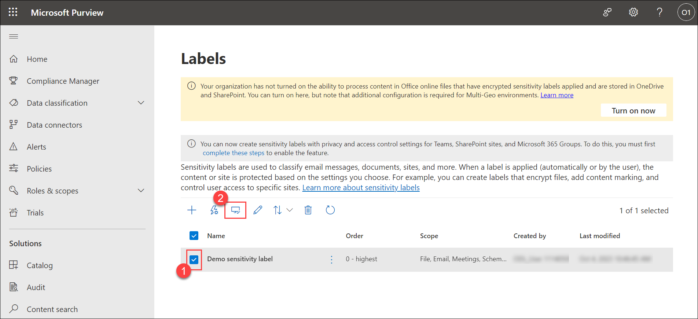

1. On the Create Policy page, select **Next**, if your sensitivity label is already selected. If not then select **Choose sensitivity labels to publish**, and select your newly created label, and then click **Next**.

1. Leave everything default on **Assign admin units** page and then click **Next**.

1. In **Publish to users and groups** pane, select **Edit**, on the **User and Groups** page, select **+ Include user or group**, and select the user and click on **Done** and again click on **Done**. Click **Next** to continue.

1. Under the **Policy Setting**, select the way you prefer and click **Next**.
   
1. Under **Default setting for documents**, in the **Apply a default label to documents**, select the label which you have created in the previous task and select next.

1. In the **Apply a default label to emails**, select the label which you have created in the previous task and select next.

1. In the **Apply a default label to meetings and calendar events**, select the label which you have created in the previous task and select next.

1. In the **Apply a default label to Power BI content**, select the label which you have created in the previous task and select next.

1. Provide a Name and Description for your policy as **Demo sensitivity label policy** and then click **Next**.

1. Click **Submit** to finish the policy creation for the label and then click on **Done**.
   
   
   
1. For your labels to work, each user needs to download the Azure Information Protection unified labeling client. Open a new tab and copy-paste this URL **https://www.microsoft.com/en-us/download/details.aspx?id=53018**, select **Download**, select this **AzinfoProtection_UL.exe**, and download. Once download completes, select **Open file**. On **Microsoft Azure Information Protection** page, select **I agree**, and after completion of the installation, select **Close**.

1. Learn more about Sensitivity labels by referring  https://docs.microsoft.com/en-us/microsoft-365/compliance/sensitivity-labels?view=o365-worldwide#:~:text=Unlike%20retention%20labels%2C%20which%20are,and%20groups%20see%20the%20labels.

### Exercise 5 : Compliance Manager 

This exercise will let you explore the features of the Compliance Manager and Customer LockBox.

#### Task 1 : Explore Compliance Manager 

Compliance Manager measures your progress in completing actions that help reduce risks around data protection and regulatory standards.

*New users won’t have enough data to view compliance in compliance center. 
Once you have enough data, you can view this compliance in compliance center. Let us now explore these features.*

In this task, you will explore Microsoft Compliance Manager.

1. On **Microsoft 365 admin centre** page, from the left-hand navigation menu, scroll down to  **Admin centers** and select **Compliance**.

   

1. From the left navigation pane select **Compliance Manager**. On the overview page, you can see your overall Compliance score, Compliance score breakdown.

   

1. In the **Compliance Manager** page, select **Improvement action**. This displays the list of actions you can take to improve your compliance score. Each improvement action provides recommended guidance that is intended to help you align with data protection regulations and standards.

   

1. In the **Compliance Manager** page, select **Solutions** tab. The solutions page displays your organization’s solutions that are connected to improvement actions. The table lists each solution’s contribution to your overall score, the points achieved and possible within that solution, and the remaining number of improvement actions grouped in that solution that can increase your score.

   

1. On the row of your intended solution, under the Remaining actions column, select the hyperlinked number. You’ll see a filtered view of the improvement actions screen showing untested improvement actions for that solution.

   

1. On the row of your intended solution, under the Open solution column, select Open. You’ll see the solution or location in the Microsoft 365 and Office 365 security and compliance centers where you can take the recommended action.

   
   
1. Now on the **Compliance Manager** page select **Assessments**. Assessments help us to implement data protection controls specified by compliance, security, privacy, and data protection standards, regulations, and laws. 

1. The assessments page summarizes key information about each assessment:

      - **Status** : Complete, Incomplete, None or In progress.
      
      - **Assessment progress**: the percentage of the work done toward completion, as measured by the number of controls successfully tested.
      
      - **Your improvement actions**: the number of completed actions to satisfy the implementation of your controls.
      
      - **Microsoft actions**: the number of completed actions to satisfy the implementation of Microsoft controls.
      
      - **Group**: name of the group the assessment belongs to.
      
      - **Product**: associated Microsoft 365 service.
      
      - **Regulation**: the regulatory standard, policy, or law that applies to the assessment.
      
   

1. In the **Assessments** dashboard, select the assessment name to open it, and view the Action Items and Controls Info.

1. To learn more about the Compliance manager refer https://docs.microsoft.com/en-us/microsoft-365/compliance/compliance-manager-setup?view=o365-worldwide.

#### Task 2 : Customer Lockbox 

Customer Lockbox ensures that Microsoft cannot access your content to perform a service operation without your explicit approval. Customer Lockbox brings you into the approval workflow for requests to access your content.

In this task, you will learn how to work with Customer Lockbox.

1. On **Microsoft 365 admin centre** page, from the left-hand navigation menu, scroll down to  **Settings** and select **Org settings**.

1. On the **Services**, in the search bar search and select  **Customer Lockbox**.

   

1. Now enable the setting **Require approval for all data access requests**, select **Save**, and close the page.

   

1. To approve or deny requests, on the left-hand navigation pane, select **Support**, select **Customer Lockbox requests**. User with Global Admin role and Customer Lockbox access approver role can approve or deny requests.

   
   
1. To learn more about Customer LockBox refer to https://docs.microsoft.com/en-us/microsoft-365/compliance/customer-lockbox-requests?view=o365-worldwide.

>**Results**: In this module, you learned to use Microsoft Security and Compliance features to secure your organization's data, information, and applications.

## Review

In this lab, you have Completed:

- Enabled MFA in AAD using Conditional Access Policy.
- Explored Microsoft Entra ID PIM.
- Explored MS Threat Protection Portal.
- Explored Microsoft Secure Score.
- Discovered Apps with Microsoft Defender for Cloud Apps.
- Setup Data sensitivity label and policy.
- Explored Compliance Manager.
- Explored Customer Lockbox.

## You have successfully completed the lab.
