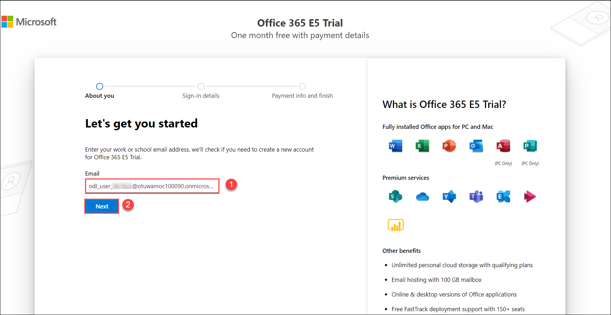
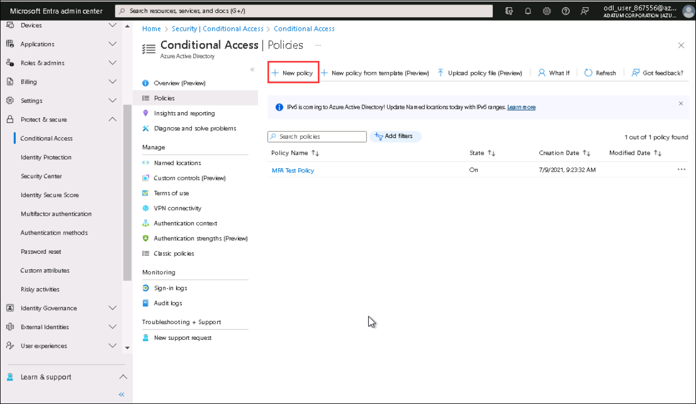
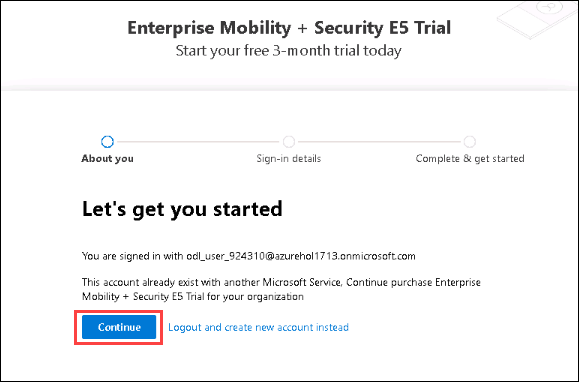
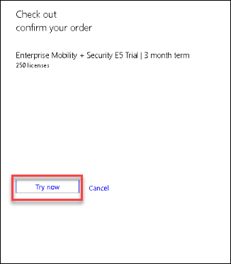

# Getting Started

1. Use the azure credentials provided in the **Environment Details** tab to log in to the **Office 365 Admin Portal**.

   

# Sign up for Office 365 E5 free trial

1. Open a new browser window, click on the [Sign up for Office 365 E5 free trial](https://www.microsoft.com/en-us/microsoft-365/enterprise/office-365-e5) and click on **Free trial**.

   

1. Then on the next screen, Enter the work email address as provided in the **Environment Details** and click on **Next**.

   

1. Click on **Sign in** and Enter the Password as provided in the **Environment Details** and click on **Sign in**.

   
   
1. If for *Stay signed in* Pops up, click on **yes**.   

1. Enter the **Phone Number**, and click on *Text Me* then it will ask you to enter a **verification code** which you have received as a SMS to the provided number and click on **Start your free trail**.
   >**Note**: Make sure to provide a valid mobile number and choose the country code properly.

   

1. It show you the confirmation Message, Click on **Try Now**.

   

1. Will receive the order Receipt and click on **Continue**.

   
   
# Sign up for Enterprise Mobility + Security E5 Trial

1. Open a new browser window, click on the [Sign up for Enterprise Mobility + Security E5 Trial](https://go.microsoft.com/fwlink/p/?LinkID=2188847&clcid=0x409&culture=en-us&country=US) and click on **Continue**.

      
   
1. It show you the confirmation Message, Click on **Try Now**.  

   

1. Will receive the order Receipt and click on **Continue**.

   
   
1. On the Next Page, Learn about how to create users, assign a license to the users, verify custom domains in the tenant, and see how to access other admin centers.    

   

