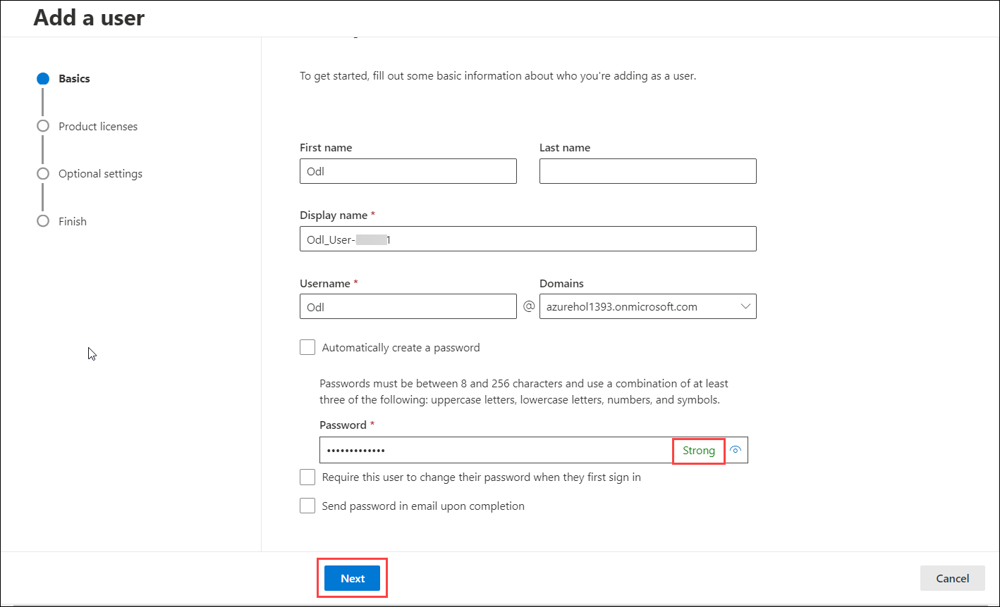
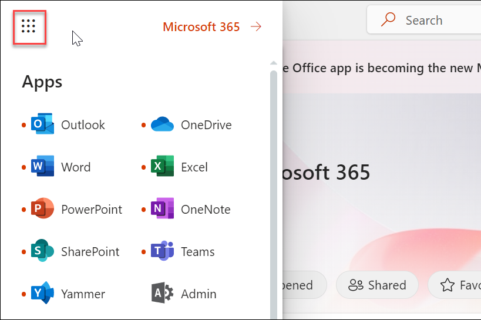
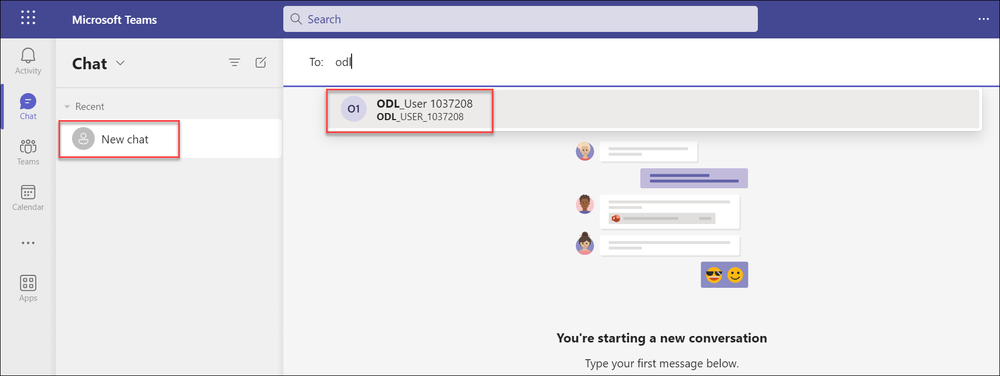

# Module 2: Microsoft Teams for Collaboration  

  Microsoft Teams is a collaboration app that helps your team stay organized and have conversations — all in one place. With Microsoft Teams on your PC, Mac, or mobile device, you can:
  
   * Pull together a team.
   * Use chat instead of email.
   * Securely edit files at the same time.
   * See likes, @mentions, and replies with just a single tap.
   * Customize it by adding notes, web sites, and apps. 

## Exercise 1: End User Experience 

In this exercise, you will learn various activities carried out in Teams such as having a Teams chat and scheduling Teams meetings.

### Task 1: Exploring through Teams [Read-Only]

In this task, we will explore the options available in Teams, learn how to create a team and add members to it.

1. From the navigation menu, click on the **Users** icon and click on **Active users**. This will display the list of active users.

    

1. Now to create a new user, from the navigation menu click on **Users icon** and click on **Active users**, and then select **Add a user** icon.

    

1. In the **Set up the basics pane**, fill the following details, and then select **Next**.

    - **First name:** Odl

    - **Display Name:**  **Odl_User-<inject key="DeploymentID" enableCopy="false"/>**

    - **Username:** Odl

        
     
     - **Automatically create a password**: unselected.

     - **Password**: Enter a strong password.
     - **Require this user to change their password when they first sign in**: unselected

        

1. In the  **Assign product licenses**  pane, choose your location from the **select location** dropdown. In the licenses section, choose **Assign user a product license** and select **office 365 E5** license. Click **Next**.

    

1. In the **Optional settings**  pane, leave everything as default and click on **Next**.

    

1. In the **Review and Finish** pane, review the new user&#39;s settings and click on **Finish adding**, then **Close**.

     
   
1. Verify that the user has been created successfully. In the Microsoft 365 admin center, in the left navigation pane, select **Users** and select **Active users**. The new user should be listed, along with their assigned license.

1. From the top left corner click on **App launcher**.

    

     >**Note**: if it asks you to choose between, **Download the windows app** or **Use the web app instead**, then select **Use the web app instead**.

1. On the left side of **Teams** you can find: 

      - **Teams** - Find channels to belong to or create your own. Inside channels, you can hold on-the-spot meetings, have conversations, and share files.

      - **Calendar** - See everything you’ve got lined up for the day or week. Or, schedule a meeting. This calendar syncs with your Outlook calendar.

      - **Calls** - In some cases, if your organization has it set up, you can call anyone from Teams, even if they are not using Teams.

      - **Activity** - Catch up on all your unread messages, @mentions, replies, and more.

1. Now open a new InPrivate window and log in to [Microsoft Teams](https://go.microsoft.com/fwlink/p/?linkid=2123761&lm=deeplink&lmsrc=FreemiumEOLWeb&cmpid=FreemiumEOL).

1. When prompted enter the username and password of the user that you created in the previous exercise.

     >**Note**: if it asks you to choose between, **Download the windows app** or **Use the web app instead**, then select **Use the web app instead**.

1. In the admin team's account, search and select the newly created user from the search bar and initiate a conversation.

     

1. Now switch back to the team's user account and verify the message.

1. To create a new team from the left navigation menu select **Teams**, click on **Join or create a team** and select **Create a new team**.

     
    
1. On **Create a team** page, select **From Scratch** option. 
   
     

1. Select **Private** if you'd like people to request permission to join or select **Public** if anyone in your organization can join.

     

1. Give the team name as **IT-Team** and add a description if needed. Select **Create**.

     

1. To Add members click on more options and select **Add members** search and select the members. When you are done adding members, select **Add** and then Close.

     

1. From here you can start a new conversation and share files.

     

### Task 2: Scheduling Teams meeting

In this task, we will learn how to schedule a meeting in Teams.

1. Open [https://admin.microsoft.com](https://go.microsoft.com/fwlink/p/?linkid=2024339), from the top left corner click on **App launcher**.

1. Select **Teams** app.

     >**Note**: if it asks you to choose between, **Download the windows app** or **Use the web app instead**, then select **Use the web app instead**.

1. Select **calendar** from the left-hand menu of the team's pane. 

1. Now click on  **+ New Meeting**. 
  
    
   
   - **Add Title:** Provide a name for the meeting.
   
   - **Add required attendees:** Search and select the odl user.
   
   - Select the date and time as per the requirements.
   
   - If it's a recurring meeting, open the dropdown menu next to **Does not repeat** (just below the date). Choose how often you want it to occur from the default options or select Custom to create your own cadence.
   
   - If you want to have your meeting in a channel, select the appropriate channel. If you’d rather not, skip it. When you have a meeting in a channel, everyone in the team will be able to see it and join in on that channel.
   
      
   
1. Microsoft Teams also has a **Scheduling Assistant** which you can use to find a time that works for everyone. 

1. Once done click on **Send**. This will close the scheduling form and send an invite to everyone's Outlook inbox.

1. To learn more about teams refer to https://docs.microsoft.com/en-us/MicrosoftTeams/get-started-with-teams-quick-start.
   
# Exercise 2: Explore Teams admin center 

In this exercise you will learn how to configure Teams policies and apply them.

### Task 1:  Manage teams policies 

In this task, we will create and assign a messaging policy to the user from the admin center and verify the effect of the policy from the team's portal. Then we will learn how to create and assign App permission policies from the team's Admin center.

1. Teams policies in Microsoft Teams can be used to control what users in your organization can do in teams and channels.

1. Go back to the Microsoft 365 Admin centers page, from the Navigation menu, click on show all and under **Admin centers** select **Teams**. This will redirect you to **Microsoft Teams admin center**.

    
   
1. From the **Left navigation menu** select **Teams** and under it select **Manage teams**. From here you can manage all the teams and channels, create new ones, and manage the existing ones.

    

1. The Manage teams page displays the list of your teams along with channels, users, and the status of the team.

1. From here you can add a new team by clicking on **+ Add**. In the **Add a new team**  page fill in the details and click on **Apply**.

    * Name: **Services-Team**
    * Privacy: **Private**

      

1. Click on your newly created team. From here you can add or remove **Members**, **channels** to the team and manage them.

1. Now from the **Left navigation menu**, select **Messaging**, select  **Messaging policies**. Messaging policies are used to control which chat and channel messaging features are available to users in Microsoft Teams.

    

1. In the **Messaging policies** page click on **+ Add**. 

    - Provide a name as **Disable giphy** and description for the policy.
   
    - Disable **Giphy in conversations** and **Delete sent messages**. You can explore through all the **Messaging policies** settings and select changes that you want.
   
    - Click on **Save**.
    
       
   
1. To assign a policy to the user, select the policy that you have created and click on **Manage Users** drop-down, select **Assign User**. In the search bar, search and add the odl user and click on **Apply**, and select **Confirm** on **Assignment will take time to take effect** pop-up.
 
    .png)

1. Switch back to the browser in which teams app is opened.

     >**Note**: close the teams calendar if it is opened.

1. Now select **New chat**, in that search with the ODL email address and type a message, and notice **Delete** option is not available.

     

11. Switch back to the browser in which microsoft admin center is opened. In the left navigation of the Microsoft Teams admin center, select **Teams apps**  and select **Permission policies**. From here you can configure App permission policies. App permission policies control what apps you want to make available to Teams users in your organization.

     .png)

1. Click on **+ Add**. 

1. Provide a name as **App restrictions** and description for the policy.

1. Under **Microsoft apps** select **Allow specific apps and block all others**. You can also select other options based on your requirement.

     

1. Select **Allow apps**, search and add for the apps that you want to allow, and then click **Allow**.

     .png)

1. Similarly, repeat the above steps for **Third-party apps** as per required. When done click **Save**.

     .png)
     
     >**Note:** Ignore any error you received while saving the policy, Go back to the **Permission policies** page, Click on **Discard**, You can see your newly created policy.
     
1. To apply this policy to specific users select your newly created policy, click on **Manage users** dropdown, select **Assign users** in the search bar search and add the odl user to apply this policy. Select **Apply**, and select **Confirm** on **Assignment will take time to take effect** pop-up..

1. This policy will enable users to access only the apps that you have allowed.

1. To learn more about teams policies refer to https://docs.microsoft.com/en-us/microsoftteams/assign-policies.

## Conclusion

  In this module, you learned how to work with Teams policies and use Teams for collaboration.
   

