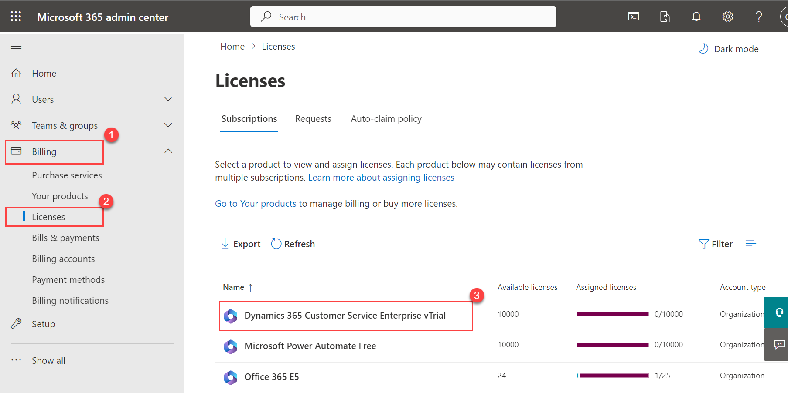
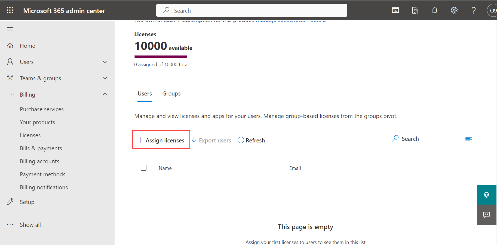
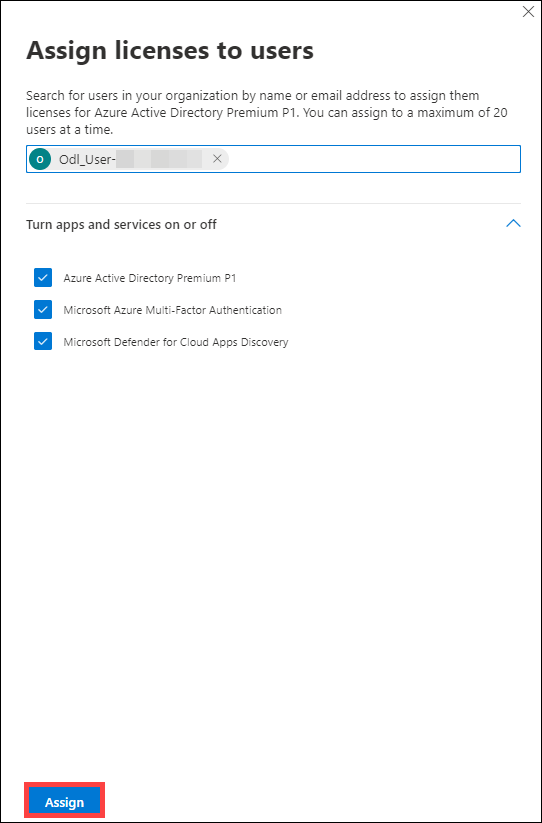
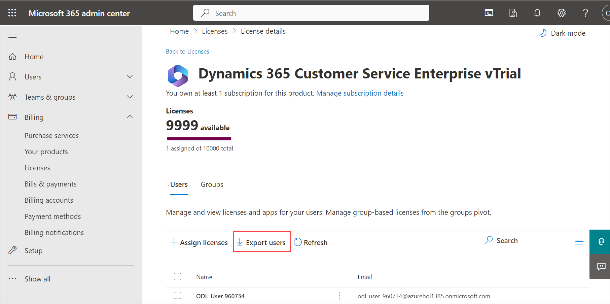
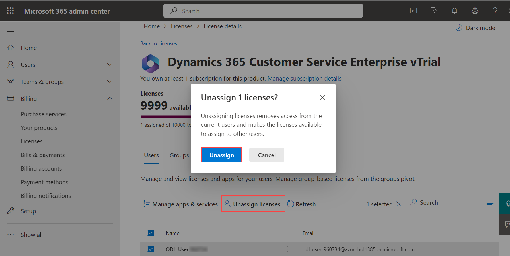

# Module 5: Licensing 

  In this module, you will browse through the licensing center and learn how to assign licenses to users from Microsoft 365 Admin center.

# Exercise 1: Browse Licensing center in M365 Admin center 

1. From the navigation menu scroll down to  **Billing (1)** and select **Licenses (2)**.
   
1. On the **Subscriptions (3)** page you can see all Available licenses, Assigned licenses. Click on **any (4)** of the License to get detailed information.

   

1. This displays the list of users to whom the selected license is assigned. From here you can assign the license to users.

1. Click on **Assign licenses**.

   

1. In the **Assign licenses to users** pane, Enter **Username** <inject key="AzureAdUserEmail"></inject>, and then choose it from the results to add it to the list. You can add up to 20 users at a time.

1. Select **Turn apps and services on or off** to assign or remove access to specific items.
   
   

1. When you are finished, select **Assign**, then select Close.

   > **Congratulations** on completing the task! Now, it's time to validate it. Here are the steps:
   > 
   > - Click the (...) icon located at the upper right corner of the lab guide section and navigate to the Lab Validation Page.
   > - Hit the Validate button for the corresponding task. If you receive a success message, you can proceed to the next task.
   > - If not, carefully read the error message and retry the step, following the instructions in the lab guide.
   > - If you need any assistance, please contact us at labs-support@spektrasystems.com. We are available 24/7 to help you out.

1. You can export the list of all users assigned with this license by clicking on **Export users**.

   

1. To Unassign licenses, Select the users for which you want to unassign licenses.

1. Select **Unassign licenses**. In the Unassign licenses box, select **Unassign**.

   

1. Switch back to the licenses page click on **Requests**. From here you can approve or deny the requests made from members of your organization for license assignments.

    

1. To learn more about licenses refer to  https://docs.microsoft.com/en-us/microsoft-365/commerce/licenses
